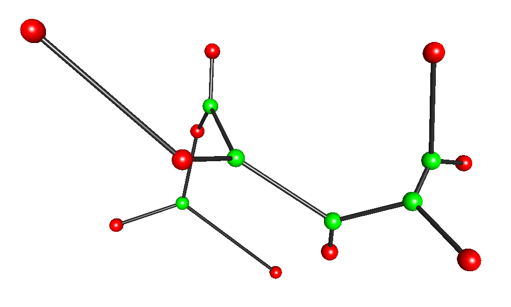

# The DB-heuristic for the Euclidean Steiner Minimal Tree in any dimension



The DB-heuristic utilizes the **D**elaunay-triangulation and **B**ottlenect distances in order to find solutions to the Euclidean Steiner Minimal Tree (ESTP) problem. In ESTP, we seek a network of minimal total edge length spanning a set of n terminal points while allowing for the insertion of additional points (Steiner points) to decrease the overall length of the network. 

The DB-heuristic is described in detail in the paper

* [Steiner Tree Heuristic in the Euclidean d-Space Using Bottleneck Distances]().

It extends the earlier DM-heuristic, which utilizes **D**elaunay triangulation and the **M**inimum spanning tree, presented in the paper

* [Euclidean Steiner Tree Heuristic in d-Space](http://dimacs11.cs.princeton.edu/workshop/OlsenLorenzenFonsecaWinter.pdf). A.E. Olsen, S.S. Lorenzen, R. Fonseca and P. Winter.

This repository contains code for the DB-heuristic, although the program may also run the DM-heuristic (se the [Usage][Usage] section below). Overview:

* [DB-heuristic code](https://github.com/StephanLorenzen/ESMT-heuristic-using-bottleneck-distances/tree/master/src) - this repository.
* [Original DM-heuristic code](https://github.com/RasmusFonseca/ESMT-heuristic) - other repository.

This repository also contains appendices with numerical results and comparisons between the DB- and DM-heuristics. Overview:

* [DB-heuristic results](https://github.com/StephanLorenzen/ESMT-heuristic-using-bottleneck-distances/blob/master/results/computational_results.pdf) - contains tables with full results achieved by the DB-heuristic and tables with comparisons to the DM-heuristic. The tables referred to in the paper [Steiner Tree Heuristic in the Euclidean d-Space Using Bottleneck Distances]() are contained in this appendix.
* [DM-heuristic results]() - contains tables with full results achieved by the DM-heuristic.

# Compiling

```
$ cd src
$ make
```

The executable depends on having the qdelaunay executable from [qhull](http://www.qhull.org) in the systems PATH. Theres an easy-to-follow explanation [in the wiki](http://github.com/RasmusFonseca/ESMT-heuristic/wiki/qdelaunay) for the original heuristic.

# Usage
[Usage]:

```
Usage: 
 esmt-heuristic [Options] <file> <name>
 esmt-heuristic [Options] <type> <d> <n>

file is a STP file and name is the name of a set in that file.
type is a set type (random, grid, sausage), d is the dimension and n is the number of
points to generate.

Options:
 -h    --help               Prints this help
 -v    --verbose            Print info during execution.
 -npo  --nopostopt          Disable fine tuning.
 -nsc  --nosubcon           Disable subgraph concatenation/sausages.
 -rdc  --redocon            Enable concatenation redo.
 -ubd  --usebdist     type  Use bottleneck distances. type must be 1 (table computation),
                            2 (lazy computation) or 3 (dyn. trees).
 -k    --facemaxsize  type  Set the maximum face size to consider for concatenation.
                            Only applicable when using -ubd.
 -alg  --alg          name  Set the subgraph heuristic to use. Must be NO, RNO or SP.
 -s    --seed         s     Use seed s for generating random point sets.
 -pt   --printtree          Print tree when done.
 -val  --validate           Validate tree when done.
 -st   --stats              Collect extra stats.
```

The important option is -ubd, which enables bottleneck distances. Recommended value is 3.
Use the -k option to reduce the number of faces considered when using bottleneck distances in higher dimensions.

# Examples
Solve one of the ESTEIN-3D library instances using bottleneck instances (dyn. tree implementation):
```
$ cd src
$ ./esmt-heuristic -ubd 3 ../data/eSteiner-3d/estein250.stp estein250-03
Done!
  |MST| = 27.1691
  |SMT| = 25.7987
  Ratio = 0.949558
```

Time the computation for 1000 random points in 4 dimensions when using the restricted numerical optimisation (RNO) heuristic for finding small FSTs:
```
$ cd src
$ time ./esmt-heuristic -ubd 3 -alg RNO random 4 1000
Done!
  |MST| = 25611.4
  |SMT| = 23952.3
  Ratio = 0.935222

real	0m9.913s
user	0m9.880s
sys	0m0.037s
```
